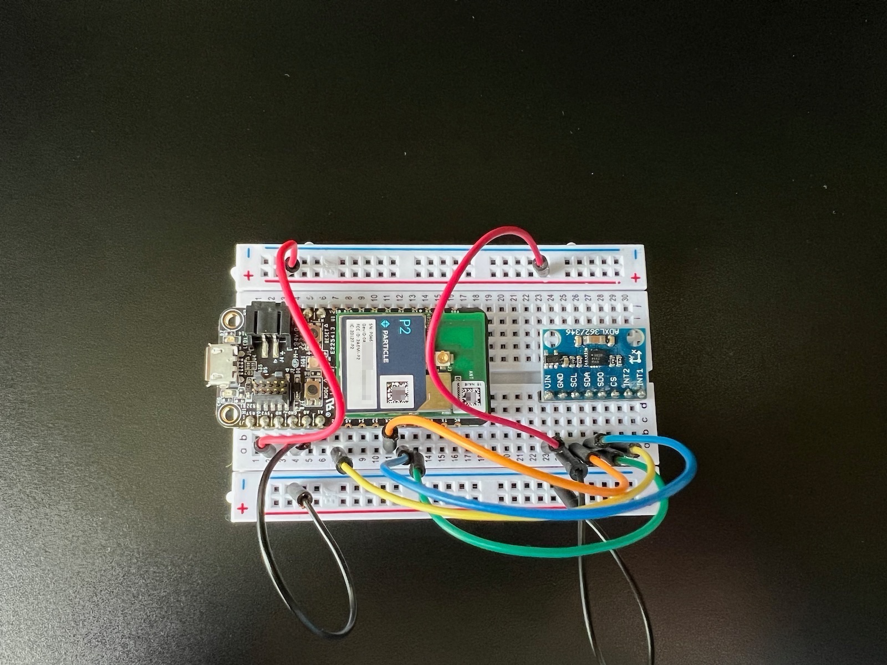

# ADXL362DMA
*Library for ADXL362 accelerometer that uses SPI DMA for efficient transfers*

The ADXL362 is an inexpensive 3-DOF ultra-low power accelerometer. It can do movement detection from rest continuously at 270 nA (yes, nano-amps!) and also has a large FIFO that makes it possible to buffer samples while the processor is busy or even sleeping. 

The GY362 is a compatible version of the ADXL362 and also works with this library.

- [Github repository](https://github.com/rickkas7/ADXL362DMA)
- License: MIT (free for use in open or closed source projects, including commercial products)
- [Datasheet](http://www.analog.com/media/en/technical-documentation/data-sheets/ADXL362.pdf)
- [Full browsable API documentation](https://rickkas7.github.io/ADXL362DMA/index.html)

## Usage

### Hardware connections

This library uses the ADXL362 in SPI mode.



| Breakout | Particle Device | Color | Description |
| :---: | :---: | :---: | :---: |
| VIN  | 3V3 | Red | 3.3V DC Power |
| GND  | GND | Black | Ground |
| SCL / SCLK  | Orange | SPI CLK |
| SDA / MOSI / SDI  | Blue | SPI MOSI |
| SDO / MISO |  Green | SPI MISO |
| CS   | A2 | Yellow | SPI Chip Select |
| INT2 | n/c | | Interrupt 2 (not used) |
| INT1 | n/c | | Interrupt 1 (not used) |


### Software

Instantiate a global object for the accelerometer. The first parameter is the SPI bus and the second is the CS line.

```cpp
ADXL362DMA accel(SPI, A2);
```

Initialize the chip:

```cpp
accel.softReset();
while(accel.readStatus() == 0) {
    Log.info("no status yet, waiting for accelerometer");
    delay(1000);
}
```

Enable measuring mode (it boots into standby mode):

```cpp
accel.setMeasureMode(true);
```
}

Read data. There is also a function to read roll and pitch data instead of raw data, see example 4-rollpitch.

```cpp
int16_t x, y, z;

accel.readXYZ(x, y, z);

Serial.printlnf("%5d %5d %5d", (int)x, (int)y, (int)z);
```

## Version history

### 0.0.7 (2023-06-02)

- Fixed occasional SOS+1 hard fault at boot when using the class as a globally constructed object.
